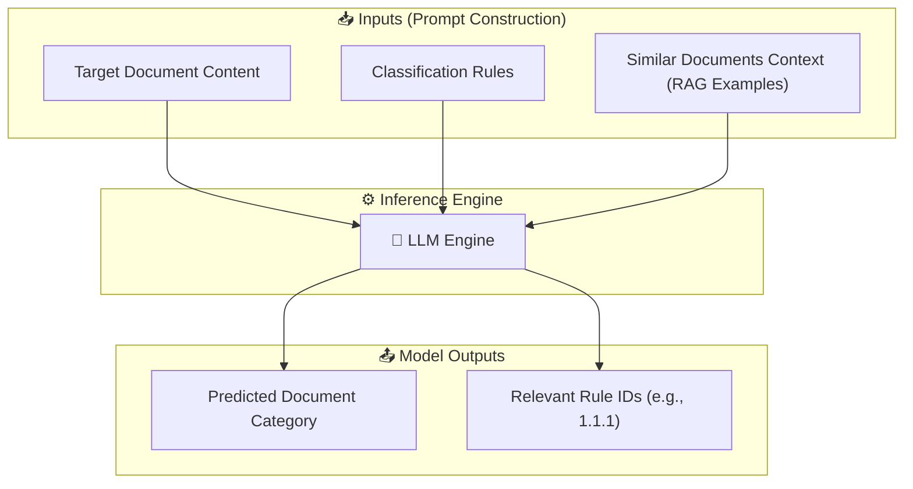

# 📜 Classification of notarial documents

## Table of Contents

* [Overview](#overview)
* [Key Features](#key-features)
* [Tech Stack](#tech-stack)
* [LLM Prompt & Inference Flow](#llm-prompt--inference-flow)
* [Quickstart & Installation](#quickstart--installation)
* [Data Preparation](#data-preparation)
* [Database Setup](#database-setup)
* [Project Layout](#project-layout)
* [Usage & Execution](#usage--execution)


## Overview

This project provides an end-to-end Machine Learning pipeline designed to classify legal and notarial documents into predefined categories using LLM-based Retrieval-Augmented Generation (RAG). The workflow integrates raw data preprocessing, database storage, and an MLflow Tracking server for experiment management and performance metrics monitoring.

## Key Features

* LLM-Based Classification
* Vector Embeddings & Retrieval
* RAG Retrieval Evaluation (Mean Precision@K, MAP@K, Mean Hit Rate, Mean Reciprocal Rank)
* LLM Classification Evaluation (Benchmarked against a Golden Dataset)
* Experiment Tracking & Monitoring
* Unit Testing

## Tech Stack

* **Python 3.14+**
* **PostgreSQL & pgvector**
* **SQLAlchemy & Alembic** — Database ORM for data persistence and Alembic for automated database schema migrations.
* **Pydantic v2 & pydantic-settings** — Strict data validation, typed boundaries, and environment settings management.
* **uv** — High-performance Python package and project management.
* **Ruff** — Extremely fast Python linter and code formatter.
* **Pytest**

## LLM Prompt & Inference Flow



## Quickstart & Installation
### Prerequisites

* **Python 3.14** or newer
* **uv** (Package and project manager)

### Installation

1. **Clone the repository:**
   ```bash
   git clone https://github.com/nata-kostina/llm-classification-of-notarial-documents.git
   cd cia
   ```

2. **Install dependencies:**
    ```bash
    uv sync --locked
    ```

3. **Configure environment variables**:
    ```bash
    cp .env.example .env
    ```
*(Edit .env to update database connections, API credentials, and paths as needed.)*

## Data Preparation

> **Note:** Due to privacy and confidentiality considerations, no real dataset or sample documents are provided in this repository. Users must supply their own document files structured according to the format expected by the ingestion pipeline.

### Required Directory Structure

To process documents correctly, your input dataset must strictly follow a hierarchical layout. Each folder level carries structural metadata (Category and Act ID):

```text
data/
└── <category_name>/          # Subfolder name must match a valid category label
    └── <act_id>/             # Subfolder name serves as the unique document/act ID
        └── designation.txt   # File containing the property text description
```
**Example Layout:**
```test
data/
├── apartment/
│   ├── act_10204/
│   │   └── designation.txt
│   └── act_10205/
│       └── designation.txt
└── garage/
    └── act_88201/
        └── designation.txt
```
### Category Validation & Customization

The parent folder names in your dataset strictly map to valid category labels. These allowed labels are enforced via a Python `StrEnum` located at:

```text
src/database/models/label.py
```
#### Default Allowed Categories:

```python
from enum import StrEnum


class LabelEnum(StrEnum):
    AGR = "agr"
    APP = "app"
    ATI = "ati"
    GAR = "gar"
    IMM = "imm"
    LAC = "lac"
    MAI = "mai"
    TER = "ter"
    VIG = "vig"
```
> **Customizing Categories:** 
> 
> * **Before Initial Setup (Fresh Install):** If you want to use custom categories from scratch, edit `LabelEnum` in `src/database/models/label.py` BEFORE generating or applying the initial Alembic migration.
> 
> * **On an Existing Database:** PostgreSQL enum types are locked in the database schema. If you modify `LabelEnum` after migrations have been applied, you must generate a new Alembic migration to update the database schema (e.g., using `ALTER TYPE ... ADD VALUE ...` or updating the migration script).
> 
> Ensure your top-level data folder names strictly match the updated enum string values.

## Database Setup

This project requires PostgreSQL with the `pgvector` extension. The easiest way to set it up is using the official Docker image.

1. **Run PostgreSQL with pgvector via Docker:**
   ```bash
   docker run -d \
     --name notarial_db \
     -e POSTGRES_USER=postgres \
     -e POSTGRES_PASSWORD=secret \
     -e POSTGRES_DB=postgres \
     -p 5432:5432 \
     pgvector/pgvector:pg16
    ```

2. **Enable the vector extension (if not automated in migrations):**
    ```bash
    docker exec -it notarial_db psql -U postgres -d postgres -c "CREATE EXTENSION IF NOT EXISTS vector;"
    ```
3. **Apply database schemas using Alembic:**
    ```bash
    uv run alembic upgrade head
    ```

## Project Layout
```text
src/
├── alembic/        # Database migrations (Alembic configuration and versions)
├── classification/ # LLM-based document classification logic
├── database/       # SQLAlchemy models, sessions, and schema definitions
├── evaluation/     # Metrics calculation 
├── ingestion/      # Document ingestion logic
├── pipeline/       # Core pipeline runners and context management
├── playground/     # Experimental code and ad-hoc analysis scripts
├── providers/      # Integration with external LLM & Embedding providers
├── retrieval/      # Vector search and document retrieval modules
├── scripts/        # Entry points for running pipeline steps
├── services/       # Core business logic and service layer abstractions
├── tools/          # Helper utilities (loggers, file tools, chunkers)
└── config.py       # Pydantic environment configuration and settings
```

## Usage & Execution

Below are the steps to execute pipelines. Replace the placeholder paths (`/path/to/...`) with your actual local paths.

### 1. Start MLflow Tracking Server

Run the MLflow UI to monitor runs, experiments, and evaluation metrics:
```bash
mlflow ui --workers 1
```
*(By default, the server will be available at `http://127.0.0.1:5000`)*

*(Note: MLflow tracking is enabled by default. If you do not want to log your pipeline runs, metrics, and artifacts to MLflow, add the `--no-log-mlflow` flag to any of the execution commands below).*

### 2. Ingestion Pipeline

Embed documents into the database:
```bash
uv run python src/scripts/run_ingestion.py --data-src /path/to/data
```
### 3. Retrieval Pipeline

Execute document similarity search:
```bash
uv run python src/scripts/run_retrieval.py --data-src /path/to/data
```
### 4. Classification Pipeline

Classify documents using RAG. Pass the appropriate RAG run ID logged in MLflow:
```bash
uv run python src/scripts/run_classification.py --rag-run-id <YOUR_RAG_RUN_ID> --data-src /path/to/data
```
*(Note: Providing `--rag-run-id` is optional. If omitted, the classification pipeline will run as a zero-shot LLM classifier without RAG context enhancement).*

### 5. Evaluation Pipeline

Run evaluation:

```bash
uv run python src/scripts/run_evaluation.py --run-id <YOUR_CLASSIFICATION_RUN_ID> --data-src /path/to/data
```
#### Available Evaluation Flags:

* `--eval-classification`: Computes classification metrics (Accuracy, Precision, Recall, F1-score) for the predicted document categories. (Enabled by default: `True`)
* `--eval-rules`: Computes metrics for the predicted classification rules identified by the LLM as critical for accurate document classification. (Enabled by default: `True`)

*(Note: To disable a default metric, pass `--no-eval-classification` or `--no-eval-rules` when running the command).*
